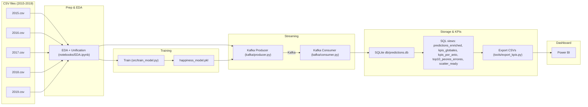
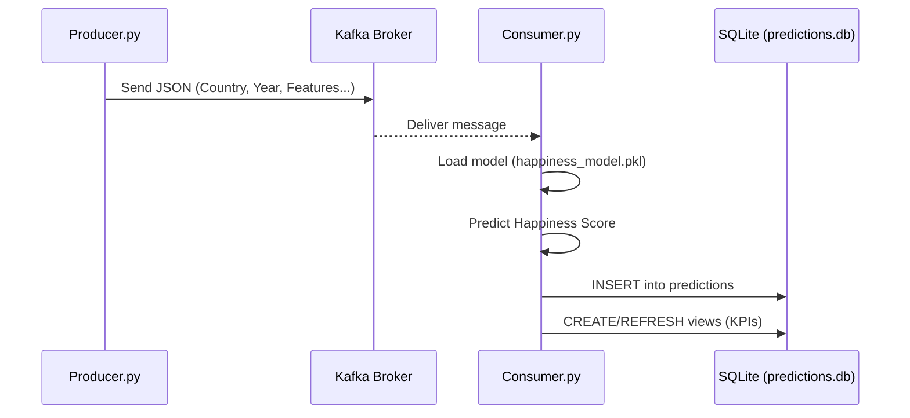

# Workshop 3 — World Happiness (2015–2019) · Streaming + ML + KPIs
**Stack:** Python 3.11 · scikit‑learn · Kafka (Docker) · SQLite · Jupyter · Power BI  
**Flow:** EDA → Train → Kafka Producer → Kafka Consumer (predict & persist) → SQL Views (KPIs) → CSV Export → Dashboard

---

## Badges
> ShadowBlack33/workshop3-etl

[]()
[]()
[]()
[]()
[]()

---

## 1) Objective

Build a full pipeline that:
1. **Prepares** World Happiness data (2015–2019).
2. **Trains** a regression model to predict *Happiness Score*.
3. **Streams** records with **Kafka Producer** and **consumes** them with a **Consumer** applying the trained model.
4. **Persists** predictions in **SQLite** and creates **SQL views** for KPIs.
5. **Exports** CSVs for **Power BI** to build an analytical dashboard.

---

## 2) Architecture

### 2.1 High‑level (Mermaid)

### 2.2 Sequence of streaming (Mermaid)


### 2.3 Repository tree
```
.
├─ data/
│  ├─ raw/                   # CSV 2015–2019 (input)
│  ├─ export/                # CSV for BI (generated by tools/export_kpis.py)
│  └─ reports/               # Evaluation CSVs (src/evaluate.py)
├─ db/
│  └─ predictions.db         # SQLite (created at runtime)
├─ docs/
│  └─ REPORT.md              # Auto-generated (src/generate_report.py)
├─ kafka/
│  ├─ producer.py
│  └─ consumer.py
├─ model/
│  └─ happiness_model.pkl    # Trained model
├─ notebooks/
│  └─ EDA.ipynb              # EDA (no images written to disk)
├─ src/
│  ├─ data_prep.py           # Load + normalize names + merge years
│  ├─ train_model.py         # 70/30 split + training + metrics + .pkl
│  ├─ evaluate.py            # Metrics from DB/CSV + exports (reports)
│  └─ generate_report.py     # Builds docs/REPORT.md from real data
├─ tools/
│  └─ export_kpis.py         # Exports SQLite views to CSV (data/export/)
├─ docker-compose.yml        # Kafka + ZooKeeper (Confluent 7.6.1)
├─ requirements.txt
├─ .env                      # Kafka topic & bootstrap
└─ README.md                 # ← this file
```

---

## 3) Data & Feature Map

During EDA we unify column names across years:

| Year | Raw columns (examples) | Normalized |
|---|---|---|
| 2015 | `Economy (GDP per Capita)`, `Health (Life Expectancy)`, `Trust (Government Corruption)` | `GDP per capita`, `Healthy life expectancy`, `Perceptions of corruption` |
| 2016 | similar to 2015 + CI columns | same normalization |
| 2017 | `Economy..GDP.per.Capita.`, `Health..Life.Expectancy.`, `Trust..Government.Corruption.` | normalized to final names |
| 2018/19 | `Country or region`, `Score`, `Freedom to make life choices` | `Country`, `Happiness Score`, `Freedom` |

**Final feature set (for model):**
- `GDP per capita`
- `Social support`
- `Healthy life expectancy`
- `Freedom`
- `Perceptions of corruption`

`Generosity` is kept for analysis but not in the final ML vector by default.

---

## 4) Environment & Installation (Windows + VS Code)

### 4.1 Python venv
```powershell
python -m venv .venv
.venv\Scripts\Activate.ps1

pip install --upgrade pip
pip install -r requirements.txt
```

### 4.2 Docker (Kafka + ZooKeeper)

**.env (example):**
```env
ZOOKEEPER_IMAGE=confluentinc/cp-zookeeper:7.6.1
KAFKA_IMAGE=confluentinc/cp-kafka:7.6.1
ZOOKEEPER_CLIENT_PORT=2181
KAFKA_PORT=9092
KAFKA_BROKER_ID=1
KAFKA_OFFSETS_TOPIC_REPLICATION_FACTOR=1
KAFKA_ADVERTISED_HOST=localhost
KAFKA_ADVERTISED_PORT=9092

KAFKA_BOOTSTRAP=localhost:9092
KAFKA_TOPIC=happiness_features
KAFKA_GROUP=happiness_group
BATCH_SIZE=200
```

**Start services:**
```powershell
docker-compose up -d
docker ps  # ensure zookeeper & kafka are healthy
```

---

## 5) How to Run (end‑to‑end)

### 5.1 EDA Notebook
Open **notebooks/EDA.ipynb** in VS Code (Jupyter) and run all cells.  
Plots remain within the notebook (no files saved).

### 5.2 Prepare & Train
```powershell
# Inspect unified features & rows
python -m src.data_prep

# Train & save model (.pkl), prints R2 / MAE / RMSE on test
python -m src.train_model
```

### 5.3 Streaming
**Terminal 1 — Consumer (persists to SQLite):**
```powershell
python kafka/consumer.py
# [consumer] listening on localhost:9092 topic=happiness_features
```

**Terminal 2 — Producer (sends records):**
```powershell
python kafka/producer.py
# Consumer shows: Saved -> {Country} {Year}: actual=... pred=...
```

### 5.4 Evaluation & Report
```powershell
# Compute metrics (global & per-year) and export report CSVs
python -m src.evaluate

# Generate docs/REPORT.md with your real numbers & tables
python -m src.generate_report
```

### 5.5 Export to BI
```powershell
# Export all SQLite views to CSV (data/export/)
python tools/export_kpis.py
```

### 5.6 Dashboard (Power BI Desktop)
1. **Get Data → Text/CSV**: import `predictions_enriched.csv`, `kpis_por_anio.csv`, `kpis_globales.csv`, `top10_peores_errores.csv` (from `data/export/`).  
2. **Data types**: `year = Whole number`, metrics = `Decimal number`, `country = Text`.  
3. Build 3 pages:
   - **Overview**: 4 Cards (n/MAE/RMSE/R²) + Column histogram (abs_error bins) + Top‑10 table + slicers (`year`, `country`).
   - **Trends**: Lines `year vs mae/rmse` and `year vs r2` (kpis_por_anio).
   - **Model Fit**: Scatter `actual vs predicted` (legend by `year`) + Bar Top‑15 avg(abs_error) by country.  
4. **Publish** to Service.

---

## 6) SQLite Schema & Views

**Table `predictions`:**
```
country TEXT
year INTEGER
gdp REAL
social_support REAL
healthy_life_expectancy REAL
freedom REAL
generosity REAL
corruption REAL
actual_happiness REAL
predicted_happiness REAL
```

**Views (auto‑created by consumer):**
- `predictions_enriched` → adds `error`, `abs_error`, `squared_error`
- `kpis_globales` → overall `n`, `mae`, `rmse`, `r2`
- `kpis_por_anio` → per‑year `n`, `mae`, `rmse`, `r2`
- `top10_peores_errores` → worst country‑year
- `scatter_ready` → pair (y, y_hat)

---

## 7) KPIs (for the dashboard)

- **Global (from `kpis_globales`)**: `MAE`, `RMSE`, `R²`, `N`
- **Per‑year (from `kpis_por_anio`)**: `MAE`, `RMSE`, `R²` by `year`
- **Analysis**: Top‑N worst errors, Actual vs Predicted scatter, Avg abs_error by country, (optional) Error vs GDP bins

---

## 8) Troubleshooting

- **Consumer not receiving**  
  - Topic in producer must match `.env` `KAFKA_TOPIC` (default `happiness_features`)  
  - Ensure `KAFKA_BOOTSTRAP=localhost:9092`; Docker Desktop running & `docker ps` healthy

- **`ModuleNotFoundError: No module named 'src'`**  
  - Run from project **root** with venv active (e.g., `python -m src.train_model`)  
  - In VS Code, select the `.venv` interpreter

- **SQLite “misuse of window function”**  
  - `kpis_por_anio` view is implemented **without** window functions in GROUP BY

- **`mean_squared_error(..., squared=False)` error**  
  - Ensure scikit‑learn ≥ **1.2** (the requirements set this); fallback computes RMSE via `sqrt(MSE)`

- **Power BI decimals (comma vs dot)**  
  - **Transform data → Data type: Decimal number → Using Locale… → English (United States)**

---

## 9) Commands (cheat‑sheet)
```powershell
# Activate venv
.venv\Scripts\Activate.ps1

# Data → unified features/rows
python -m src.data_prep

# Train
python -m src.train_model

# Kafka
docker-compose up -d
python kafka/consumer.py
python kafka/producer.py

# Evaluation & Report
python -m src.evaluate
python -m src.generate_report

# Export for BI
python tools/export_kpis.py
```

---

Include in repo:
- `notebooks/EDA.ipynb`
- `src/*.py`, `kafka/*.py`, `tools/export_kpis.py`
- `model/happiness_model.pkl`
- `docs/REPORT.md`
- `docker-compose.yml`, `.env` (if allowed), and this `README.md`

